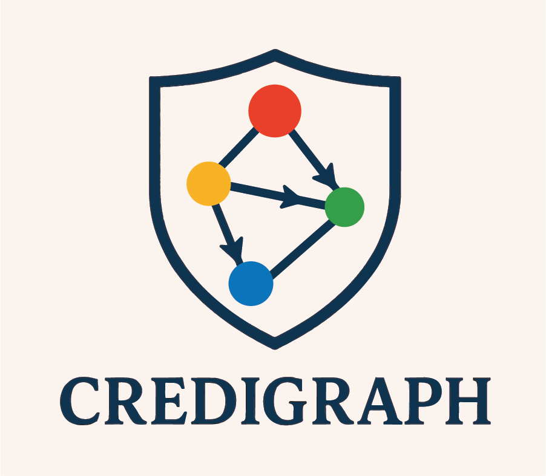

# CrediGraph

Data analysis for TG/RAG project @ CDL



## Getting Started

### Prerequisites

The project uses [uv](https://docs.astral.sh/uv/) to manage and lock project dependencies for a consistent and reproducible environment. If you do not have `uv` installed on your system, visit [this page](https://docs.astral.sh/uv/getting-started/installation/) for installation instructions.

**Note**: If you have `pip`, you can invoke:

```sh
pip install uv
# or
brew install uv
```

### Installation

```sh
# Clone the repo
git@github.com:ekmpa/CrediGraph.git

# Enter the repo directory
cd CrediGraph

# Install core dependencies into an isolated environment
uv sync

# The isolated env is .venv
source .venv/bin/activate
```

## Usage

### Running full data processing scripts

```sh
cd bash_scripts

./end-to-end.sh /bash_scripts/CC-Crawl/CC-2025.txt
```

### Running GNN Baseline Experiment

```sh
uv run tgrag/experiments/main.py
```

Alternatively, you can design you own configuration.

```sh
uv run tgrag/experiments/main.py --config configs/your_config.yaml
```
